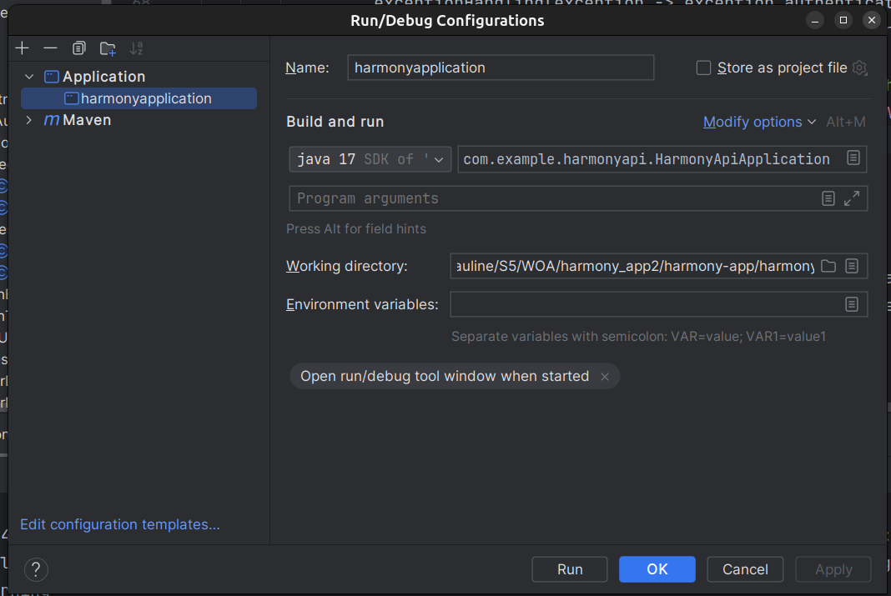

# harmony

Une application d'harmonisation des dépenses.

Le frontend est développé avec Vue.js 3 et le backend est développé avec Spring Boot. Elle offre une interface interactive aux utilisateurs, leur permettant de s'inscrire, créer des groupes, gérer les membres, et gérer les dépenses du groupe.
Les requêtes HTTP sont gérées avec Axios et les formulaires utilisent Vee-Validate et Yup.

Prérequis

Pour lancer ce projet, vous devez avoir installé :

- Docker
- Git pour cloner le projet

Installation

Tout d'abord clonez le projet dans un dossier à l'aide de git clone <url>

Base de données

1. Créez une nouvelle base de données "harmony_db"
2. Créez une nouvelle connexion avec comme pseudo : pauline et comme mot de passe : harmony_db

Backend

1. Ouvrez le dossier "harmony-api" dans l'IDE intellij.
2. Ajoutez la configuration pour lancer l'application (le bouton à gauche du bouton play) comme sur l'image ci-jointe

Frontend

1. Ouvrez le dossier front-end3/font-end (copy) dans votre terminal
2. Installez le projet en exécutant la commande : '''bash npm run dev'''
3. Ouvrez le lien apparaissant dans votre terminal
